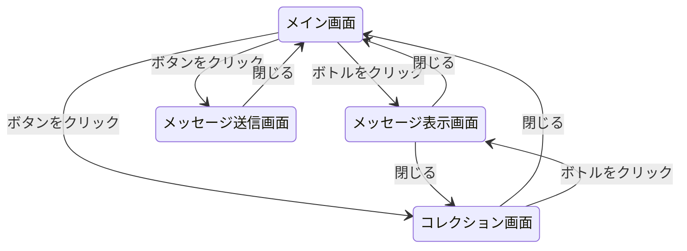
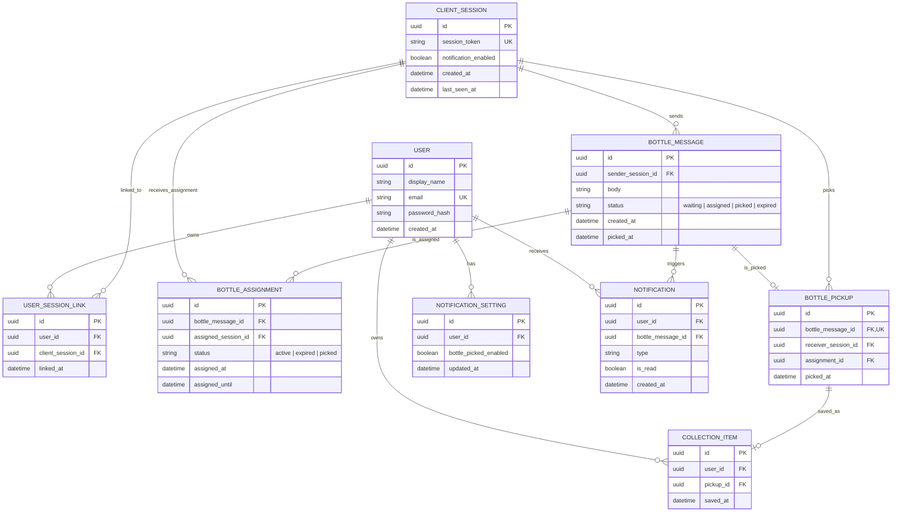

## 1.3 画面遷移図



# 2. 内部設計

## 2.1 詳細DB設計

|エンティティ|役割|
|---|---|
|**USER**|ログインユーザー本体|
|**CLIENT_SESSION**|ログインなしユーザーを一時的に識別する|
|**USER_SESSION_LINK**|匿名セッションとログインユーザーの紐づけ|
|**BOTTLE_MESSAGE**|投稿されたボトルメール本体|
|**BOTTLE_ASSIGNMENT**|ボトルが特定の1人の画面に流れている状態|
|**BOTTLE_PICKUP**|ボトルが実際に受け取られた記録|
|**COLLECTION_ITEM**|受け取ったボトルの保存記録|
|**NOTIFICATION_SETTING**|通知設定|
|**NOTIFICATION**|通知イベント|



## 2.2 API・モジュール設計

### ボトル放流API**(`POST /api/messages`)**

- **概要**: ユーザーが手紙を書いて「ながす」ボタンを押した際に呼び出される。
    
- **処理**:
    
    1. `sender_session_id` が `CLIENT_SESSION` に存在するか確認する。
    2. `body` が空でないか確認する。
    3. `BOTTLE_MESSAGE` に新規レコードを作成する。
    4. `status` は `"waiting"` に設定する。
    5. 作成したメッセージ情報を返す。
- **Request**
    
    |項目|型|必須|説明|
    |---|---|---|---|
    |`body`|string|必須|ボトルに入れる本文|
    |`sender_session_id`|uuid|必須|送信者のセッションID|
    
    ```json
    {
    	"body": "こんにちは。",  
    	"sender_session_id": "uuid"
    }
    ```
    
- **Response**
    
    ```json
    {
      "id": "uuid",
      "body": "こんにちは。",
      "status": "waiting",
      "created_at": "2026-06-09T12:00:00Z"
    }
    ```
    

### 漂流ボトル取得API**(`GET /api/stream?session_id=uuid`)**

- **概要**: メイン画面を表示する際、自分の画面に流すべきボトルを取得する。
- **役割**:
    1. サーバー側で、現在 **`"waiting"`** 状態の **`BOTTLE_MESSAGE`** をランダムに選定。
    2. 選定したメッセージに対し、自分専用の BOTTLE_ASSIGNMENT レコードを作成。
    3. **`BOTTLE_MESSAGE`** の **`status`** を **`"assigned"`** に更新し、他の人の検索対象から外す。
- **Response**
    - **成功**
        
        ```json
        {
          "assignment_id": "uuid",
          "message": {
            "id": "uuid",
            "body": "こんにちは。"
          },
          "assigned_until": "2026-06-09T12:30:00Z"
        }
        ```
        
    - **失敗**
        
        ```json
        {
          "message": null
        }
        ```
        

### 割り当て期限切れ（再放流）API**(`PATCH /api/assignments/{id}/expire`)**

- **概要**: 表示されていたボトルが画面から消えていった際に呼び出され、ボトルの状態を待機中に戻す。
    
- **役割**:
    
    1. 指定された `BOTTLE_ASSIGNMENT` を取得
    2. `status = active` であることを確認
    3. `BOTTLE_ASSIGNMENT.status = expired`
    4. 対応する `BOTTLE_MESSAGE.status = waiting`
    5. 更新結果を返却
- **Request**
    
    - Path Parameter
        
        |項目|型|必須|説明|
        |---|---|---|---|
        |assignment_id|uuid|必須|期限切れにする割り当てID|
        
    - Body
        
        なし
        
- **Response**
    
    ```json
    {
      "assignment_id": "uuid",
      "status": "expired",
      "message_status": "waiting"
    }
    ```
    

### ボトル回収API**(`POST /api/messages/{id}/pickup`)**

- **概要**: ユーザーがボトルをクリックし、「ひろう」ボタンを押した際に呼び出されます。
    
- **役割**:
    
    1. `message_id` の存在確認
    2. `assignment_id` が対象メッセージに紐づくか確認
    3. `BOTTLE_PICKUP` を作成
    4. `BOTTLE_MESSAGE.status = picked`
    5. `BOTTLE_MESSAGE.picked_at = 現在時刻`
    6. `BOTTLE_ASSIGNMENT.status = picked`
    7. 本文を返却
- **Request**
    
    - Path Parameter
        
        |項目|型|必須|説明|
        |---|---|---|---|
        |message_id|uuid|必須|回収するボトルID|
        
    - Body
        
        |項目|型|必須|説明|
        |---|---|---|---|
        |assignment_id|uuid|必須|自分に割り当てられたAssignment|
        |receiver_session_id|uuid|必須|回収者のセッションID|
        
        ```json
        {
          "assignment_id": "uuid",
          "receiver_session_id": "uuid"
        }
        ```
        
- **Response**
    
    ```json
    {
      "message_id": "uuid",
      "body": "こんにちは。どこかの誰かへ。"
    }
    ```
    

### コレクション・履歴取得API **(`GET /api/collection?session_id=uuid`)**

- **概要**: コレクション画面を表示するためのAPI。
    
- **役割**:
    
    1. **`BOTTLE_PICKUP`** から「自分が拾ったメッセージ」の一覧を取得。
    2. **`BOTTLE_MESSAGE`** から「自分が送信したメッセージ（**`sender_session_id`**が自分）」の一覧を取得。
- **Response**
    
    ```json
    {
      "picked_messages": [
        {
          "pickup_id": "uuid",
          "message_id": "uuid",
          "body": "誰かが流したメッセージです",
          "picked_at": "2026-06-09T12:00:00Z"
        }
      ],
      "sent_messages": [
        {
          "message_id": "uuid",
          "body": "自分が流したメッセージです",
          "status": "picked",
          "created_at": "2026-06-09T10:00:00Z",
          "picked_at": "2026-06-09T12:00:00Z"
        }
      ]
    }
    ```
    

### セッション更新API **(`PUT /api/session/active`)**

- **概要**: 現在サイトを開いている人数を維持するためのAPI。
    
- **役割**: **`CLIENT_SESSION`** の **`last_seen_at`** を現在時刻に更新する。
    
- **Request:**
    
    |項目|型|必須|説明|
    |---|---|---|---|
    |session_id|uuid|必須|更新対象セッション|
    
    ```json
    {
      "session_id": "uuid"
    }
    ```
    
- **Response:**
    
    ```json
    {
    "session_id": "uuid",
    "last_seen_at": "2026-06-09T12:00:00Z"
    }
    ```